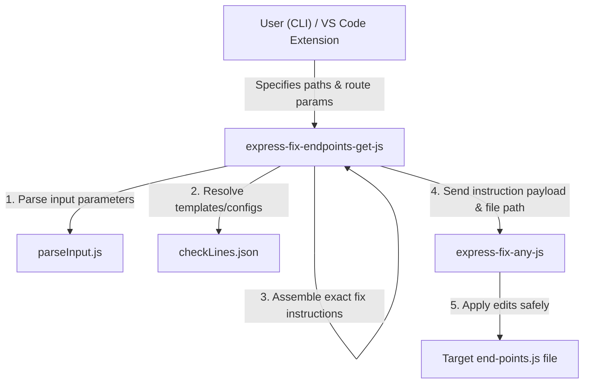

# express-fix-endpoints-get-js

`express-fix-endpoints-get-js` is a utility tool developed by **KeshavSoft** specifically designed to modify and maintain `end-points.js` router files in Express.js backend applications.

It operates as both a standalone CLI and an SDK utilized by VS Code extensions (like `EndPointGen`) to coordinate route generation.

## 🎯 Core Concept & Behavior

1. **Target File**: This tool runs specifically and exclusively on `end-points.js` files.
2. **Delegated Modifying Engine**: It does not modify files directly. Instead, it delegates all physical file reading, editing, checking, and writing tasks to the core package **`express-fix-any-js`**.
3. **Definition Source**: This repository (`express-fix-endpoints-get-js`) holds the configuration and logic that specifies *what* to fix, defined across different routing patterns (simple, parameterized, and dynamic parameterized). It builds these instruction definitions dynamically and sends them to `express-fix-any-js` to apply the updates.

---

## 🔌 API Exports

The package exposes the following programmatic exports from [index.js](file:///d:/KeshavSoftRepos/2026-07-12(1)/express-fix-endpoints-get-js/index.js):

### `default` (load function)
Executes the fix process by dynamically loading the latest version core generator and writing files.
```javascript
import expressFix from "express-fix-endpoints-get-js";

await expressFix({
  endPointsJsPath: "/path/to/end-points.js",
  inFolderName: "ShowAll",
  inActionName: "ShowAll",
  inGetType: "simple",
  showLog: true
});
```

### `getCheckLinesKeys()`
Returns a list of all valid `inGetType` keys defined in the latest configuration.
```javascript
import { getCheckLinesKeys } from "express-fix-endpoints-get-js";

const keys = await getCheckLinesKeys();
// Returns: ["simple", "withParams", "withParamsDynamic"]
```

### `getCheckLinesValue({ inKey })`
Returns the un-interpolated checkLines configuration structure for a specific key.
```javascript
import { getCheckLinesValue } from "express-fix-endpoints-get-js";

const result = await getCheckLinesValue({ inKey: "simple" });
```

---

## 💻 CLI Commands

You can run these commands via `npx` or using globally/locally installed scripts:

### `ShowKeys`
Prints the list of all supported route types:
```bash
npx @keshavsoft/kschema-api-gen ShowKeys
# Output: [ 'simple', 'withParams', 'withParamsDynamic' ]
```

### `ShowValue <key>`
Prints the configuration details (imports, matching rules, output structures) for a specific route type:
```bash
npx @keshavsoft/kschema-api-gen ShowValue simple
```

---

## 🛠️ Insertion Types & Configurations

The tool resolves specific import templates and route declarations depending on the requested type:

### 1. Simple GET Route (`simple`)
- **Imports**: `import funcFrom[FolderName] from './[FolderName]/controller.js';`
- **Routes**: `router.get('/[endpoint]', (req, res) => funcFrom[FolderName]({ req, res, inTablePath: tablePath }));`

### 2. GET Route with Primary Key Parameter (`withParams`)
- **Imports**: `import funcFrom[FolderName] from './[FolderName]/controller.js';`
- **Routes**: `router.get('/[endpoint]/:pk', (req, res) => funcFrom[FolderName]({ req, res, inTablePath: tablePath }));`

### 3. GET Route with Dynamic Column Parameter (`withParamsDynamic`)
- **Imports**: `import funcFrom[FolderName] from './[FolderName]/controller.js';`
- **Routes**: `router.get('/[endpoint]/:[ColumnName]', (req, res) => funcFrom[FolderName]({ req, res, inTablePath: tablePath }));`

---

## 🧩 Architectural Flow



---

## 🔒 Duplicate Protection & Formatting Rules

When the instruction payload is processed by the underlying engine:
- **Duplicate Prevention**: If the route pattern or import already exists in `end-points.js`, the update is skipped.
- **Formatting Hygiene**: Ensures that spacing rules are respected (e.g., blank lines after router initialization and before exports) to keep the generated files clean and consistent.
